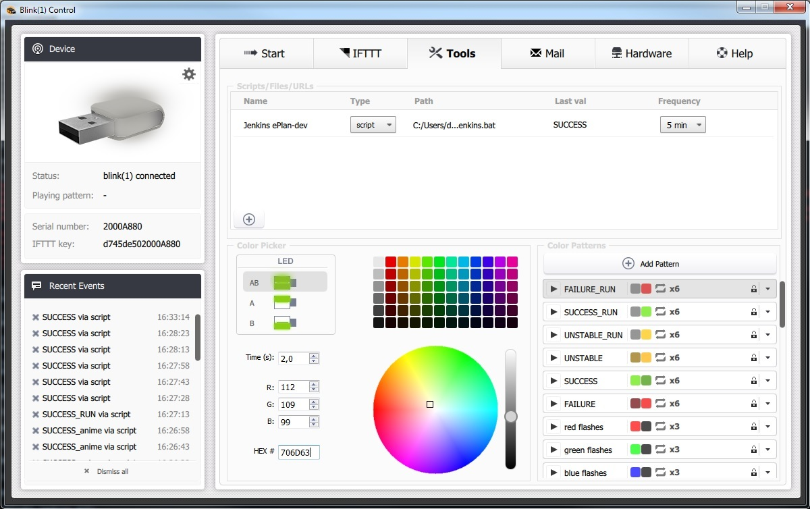

# blink1-jenkins-ps1
PowerShell script to poll JENKINS / HUDSON project status to display ist with blink(1) USB RGB LED

Polls JENKINS JSON API for a given project and job to control the USB RGB LED [ThingM blink(1)](https://blink1.thingm.com/)
This script is used to add so called 'extreme feedback devices' to all develeopers machines.

The current build status is live displayed as blinking (while build is running) or slow glowing red / yellow / green colors.

## Requirements

- Software [Blink(1) Control](http://blink1.thingm.com/blink1control/)
- Windows 7 or newer with PowerShell 3.x or newer
- JENKINS 2.6 or newer
- user account with read rights for JENKINS project

## Setup

### Windows

The PowerShell script to evaluate the Jenkins/Hudson JSON build status doesn't work on network shares / network profiles due to security reasons.

Therefore the delivered batch-startscript assumes that all files are installed under **%PROGRAM_FILES%\blink1-jenkins-ps1\**.

1. create directory %PROGRAM_FILES%\blink1-jenkins-ps1\
2. copy files **blink1-jenkins.ps1** and **poll-jenkins.bat** into thid dir

### Other OS

Currently this script is only tested under Windows 7+10, but should work with [PowerShell for Linux](https://docs.microsoft.com/de-de/powershell/scripting/setup/installing-powershell-core-on-linux?view=powershell-6) comparably, too.

### Jenkins URL and login data

All login credentials and the Jenkins host + project path must be updated inside the **blink1-jenkins.ps1**

e.g.:
```
# settings - EDIT HERE!!!
$jenkins_host 	= "https://myserver"
$jenkins_project= "MyProject/job/MyBuildJob"
$jenkins_user	= "myuser"
$jenkins_pass 	= "ThisPasswordIsSecretLOL"
# end of settings
```

### Blink(1) color patterns

In order to set your LED depending on the Jenkins / Hudson build status the Blink(1) GUI tool needs matching color patterns:

| Jenkins build color | Blink(1) color pattern |
|---------------------|------------------------|
| red                 | FAILURE |
| blue       		      | SUCCESS |
| green      	       	| SUCCESS |
| yellow     		      | UNSTABLE|
| disabled   		      | UNSTABLE|
| red_anime  		      | FAILURE_RUN|
| blue_anime		      | SUCCESS_RUN|
| green_anime		      | SUCCESS_RUN|
| yellow_anime	      | UNSTABLE_RUN|
| disabled_anime      |	UNSTABLE_RUN|


### Blink(1) task

1. clone this repository to any dir, reachable by an absolute path starting with a drive letter (the blink(1) software has problems with network shares)
2. edit the `blink1-jenkins.ps1` to enter your JENKINS host url, job name, user and password
3. open Blink(1) Control, attach your blink(1) USB RGB LED
4. open the settings dialog by clicking on the settings-icon above the blink(1) image
5. import the configuration for color patterns provided in `Blink1-Control-settings.ini`
6. close settings and go to "Tools"
7. add a "script" and select the `poll-jenkins.bat` and select your polling frequency - e.g. 15 seconds
8. right click on the setting and click on "Test tool"



If anything goes wrong, just open a command line an run `poll-jenkins.bat` manually. 

For a successful build you schould get an output like:
```
{ "pattern": "SUCCESS" }
```

The Blink(1) Control has some pitfalls - e.g. it cannot exec scripts on network shares / network profiles and sometimes it crashes. So just unplug the USB blink(1) and restart the tool on errors.
